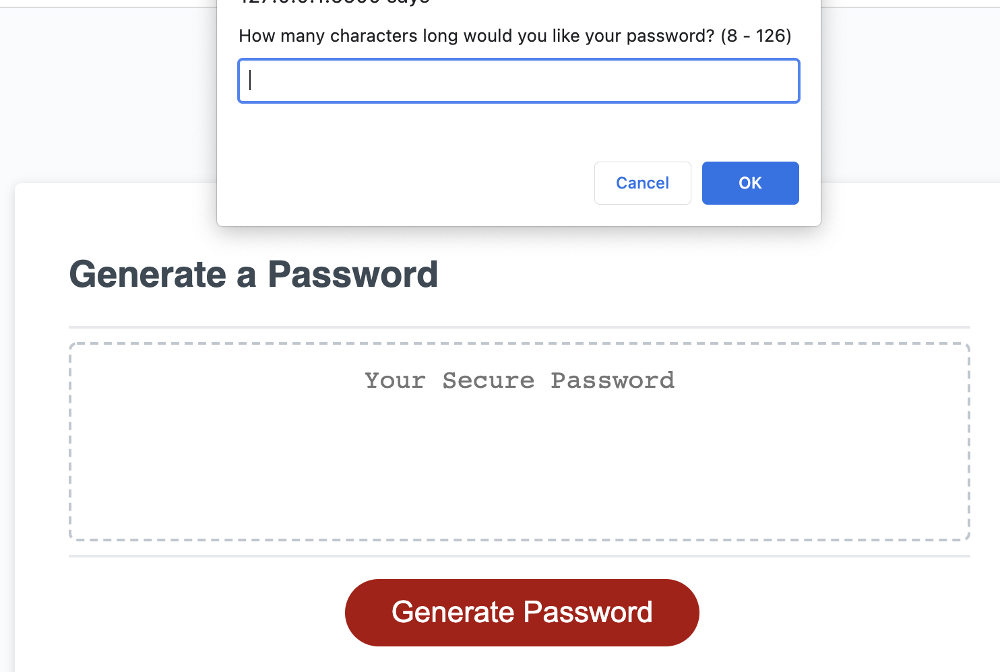
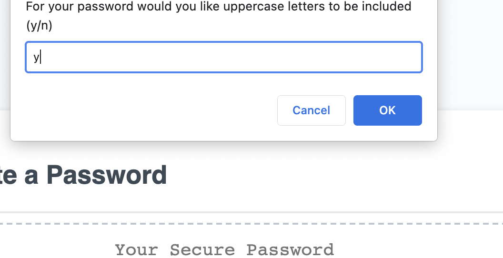
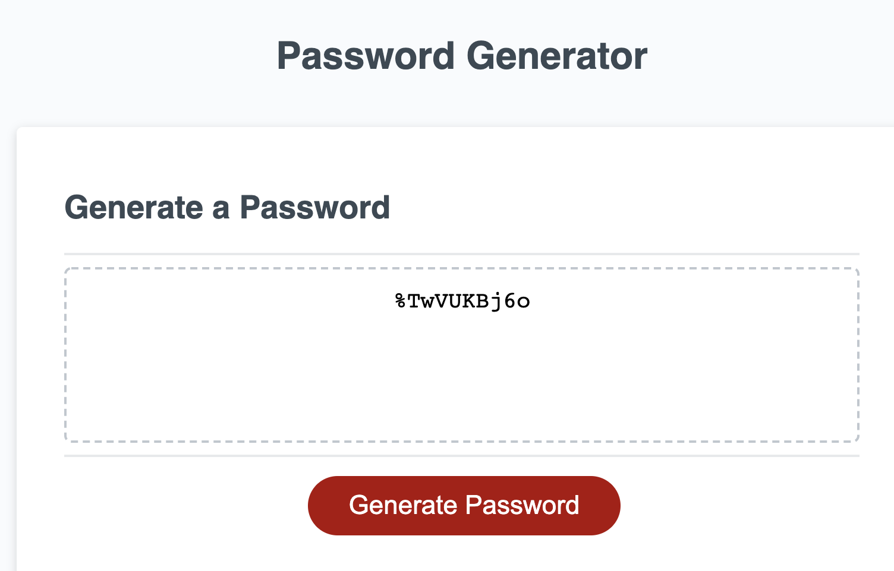

# Password Generator by Michael Wegter
## U of M Bootcamp Challenge 3

This application is for generating a random password to meet length and character requirements input by the user

The user is presented with a screen labeled "Password Generator" and has a generate password button. After clicking the button, the user is prompted with the options they can select, then after all prompts are answered, a password is generated. Here are screenshots of the process. Thanks!

Made from repo: Password Generator Starter Code link: https://github.com/coding-boot-camp/friendly-parakeet
