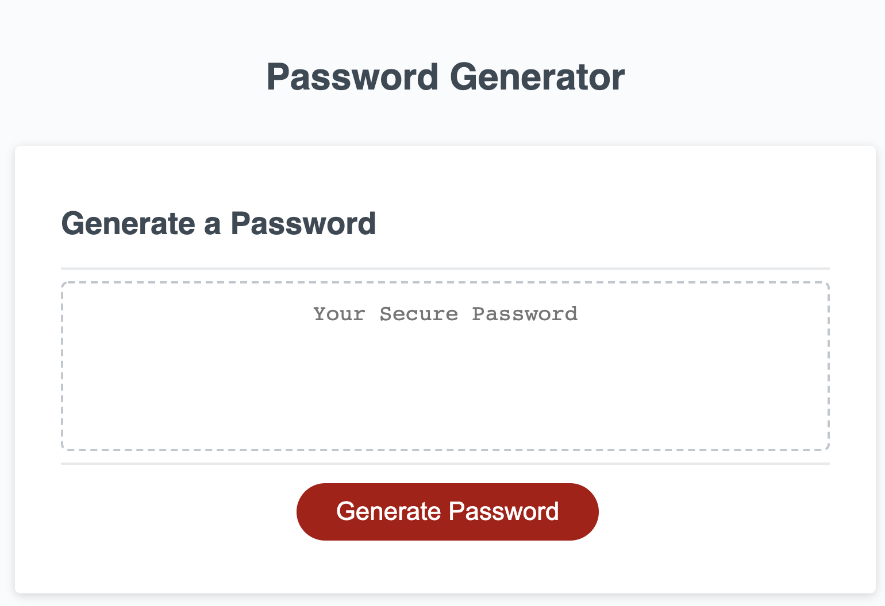

# Password Generator by Michael Wegter
## U of M Bootcamp Challenge 3

This application is for generating a random password to meet length and character requirements input by the user

The user is presented with a screen labeled "Password Generator" and has a generate password button

Made from repo: Password Generator Starter Code link: https://github.com/coding-boot-camp/friendly-parakeet
